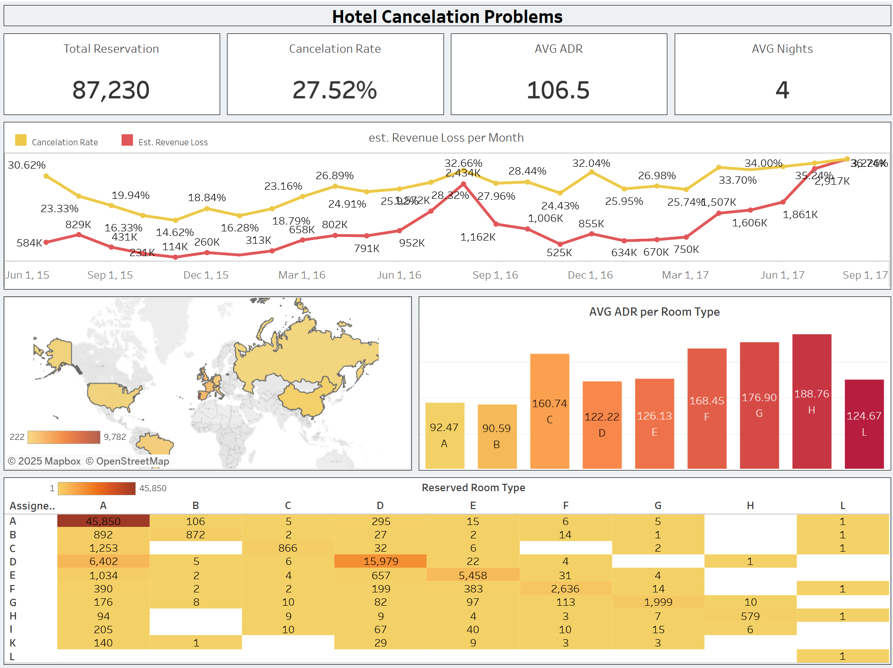
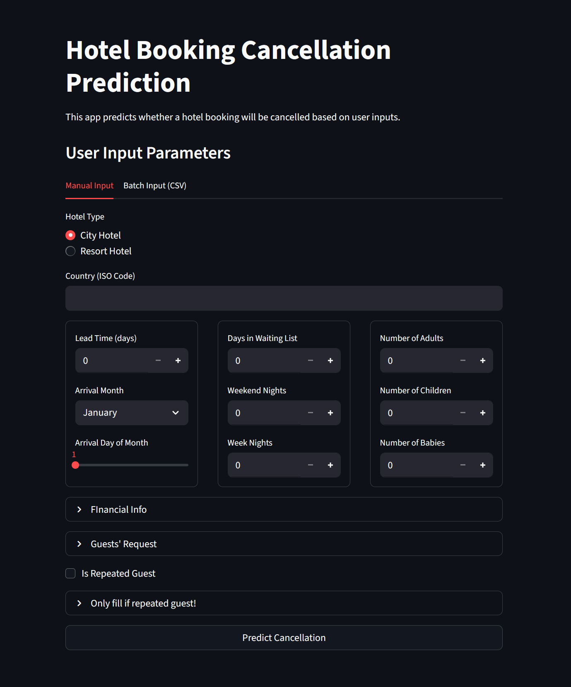

# Hotel Booking Cancellation Prediction

## Authors
- **Ridwan Darmawan**  
- **Reyner Thaddeus Purwanto**

---

## Project Overview
Hotel booking cancellations can significantly affect revenue management. In this project, we aim to **predict the likelihood of a hotel booking being canceled** and provide actionable recommendations for hotel managers.

- **Cancellation Rate (X):** 37.04%  
- **Estimated Revenue Loss (Y):** ≈ 16.7 million (≈39.15% of potential revenue)  

> This high cancellation rate highlights the need for a predictive model, so hotels can apply preventive strategies such as **overbooking**, **deposit policies**, and **targeted customer segmentation**.

---

## Business Problem
- **Who is affected?** Hotel managers, revenue teams, and operations.  
- **What is the problem?** High cancellation rates cause unpredictable occupancy and revenue loss.  
- **Why is it important?** Every canceled booking leads to lost revenue opportunities.  
- **Goal:** Build a machine learning model to predict cancellations and recommend business actions.  

---

## Project Structure
1. **Problem Statement & Data Understanding**  
   - Define cancellation problem & stakeholders  
   - Dataset: Hotel Bookings Dataset (2015–2017, Europe)  

2. **Exploratory Data Analysis (EDA)**  
   - Distribution of cancellations by time, market segment, deposit type, ADR, etc.  
   - 5W1H storytelling insights  

3. **Preprocessing**  
   - Handling missing values, duplicates, and outliers  
   - Encoding categorical features  
   - Feature engineering (total nights, potential revenue)  

4. **Modeling & Evaluation**  
   - Algorithms: Logistic Regression, Random Forest, XGBoost  
   - Metrics: **PR-AUC, F1-score** (more suitable for imbalanced classification)  
   - Cross-validation for reliable evaluation  
   - SHAP values for interpretability  

5. **Conclusion & Recommendation**  
   - Actionable strategies for hotels (deposit policies, overbooking, segmentation focus)  
   - Business impact estimation  
   - Limitations & future improvements (data scope, external factors, deployment)  

---

## Tableau Dashboard
We created an interactive Tableau dashboard to visualize the cancellation patterns and insights.  

[Hotel Cancellation Dashboard (Tableau)](https://public.tableau.com/app/profile/ridwan.darmawan/viz/HotelCancellation_17585921650630/HotelCancelation?publish=yes)  



---

## Streamlit App
We also provide a deployment of the ML model in Streamlit, allowing stakeholders to input booking details and get cancellation predictions.  

[Hotel Prediction App (Streamlit)](https://lazymoo35-hotel-modelll-main-qocaxv.streamlit.app/)  



---

## Conclusion
- Around **37% of hotel bookings are canceled**, causing nearly **40% potential revenue loss**.  
- The model can help **identify high-risk bookings early**, enabling better revenue management.  
- **Business Recommendations:**  
  - Require deposits for high-risk segments  
  - Apply overbooking strategies based on predictions  
  - Focus marketing on low-cancellation customer segments  

---

## Repository Structure
```
├── hotel_tableau                # Tableau working dir
   ├── Hotel Cancellation.twbx   # Tableau file
├── Hotel_Cancellation.ipynb     # Main notebook
├── Hotel_Cancellation.joblib    # Model file
├── hotel_bookings.csv           # Dataset
├── main.py                      # Streamlit main script
├── requirements.txt             # Requirements for streamlit's modules
├── requirements-notebook.txt    # Requirements for notebook's modules
├── README.md                    # Project documentation
```

 
